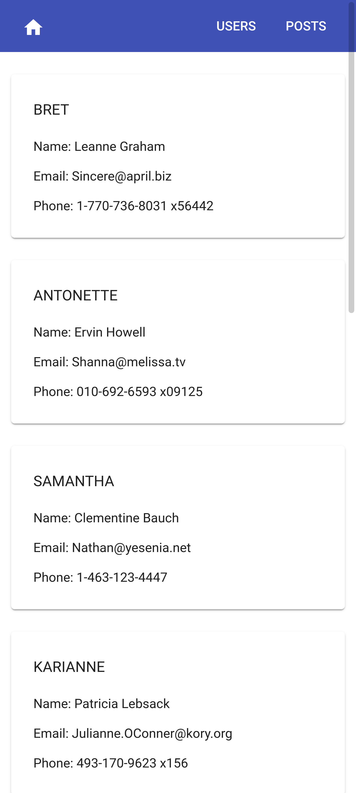
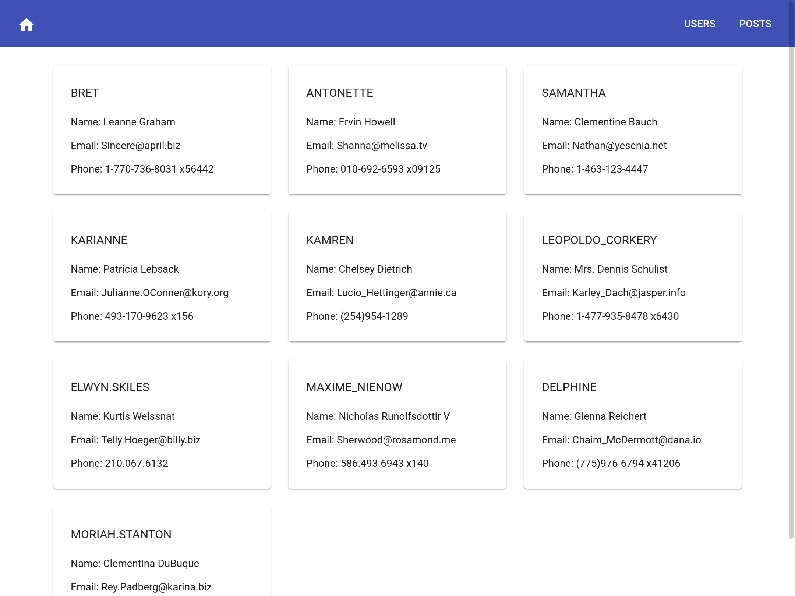
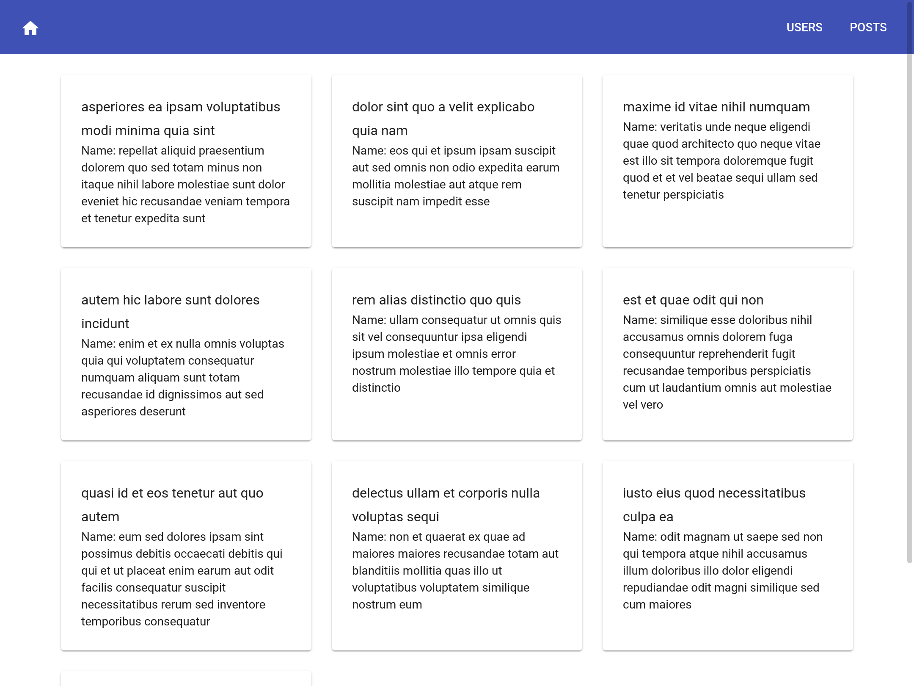

# Test

This project was generated with [Angular CLI](https://github.com/angular/angular-cli) version 14.2.0.

## Problema
Aplicacion con un componente login (usuario de prueba sin autenticación de backend). Página de inicio donde lea los usuarios de este servicio https://jsonplaceholder.typicode.com/users , mostrar los usuarios en mayúscula mediante una pipe y cada vez que se dé click obtener los posts hechos por el usuario clickeado. Los posts se obtienen de este servicio https://jsonplaceholder.typicode.com/posts. Toda la aplicación debe ser responsiva mediante el framework bootstrap.

## Capturas de pantall

